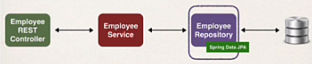

# Employee Directory RestAPI

A project utilizing Spring Boot and Maven to create an Restful API that supports CRUD capability for the Rest clients.
The sample data is stored in MySQL server along with Hibernate JPA to access the data. The purpose of this project is to
build a demo API that supports creating, reading, updating and deleting the employees directory info.

### API Structure
Employee REST Controller <=> Employee Service <=> Employee Repository <=> Database (MySQL)

- Employee REST Controller:

  The REST Controllers handle the HTTP requests and responses from the REST clients and the return packages from the
Employee Service respectively.

- Employee Service:

  The Employee Services manage service layer and the transactional aspect of the CRUD actions with the database. That is to say, the services
would also call the corresponding methods from the DAO.

- Employee Repository:

  The Employee Repository was refactored from writing our own DAO (Data Access Object). The JPA Repository comes with 
standard CRUD functions, including findAll(), save, deleteById(), etc. The Employee Repository would retrieve the data 
from the databases.

### REST Endpoints

The project's endpoints are currently at the default localhost port 8080.

http://localhost:8080/api

| HTTP Method | Endpoint                | Description                    |
|:-----------:|:------------------------|:-------------------------------|
|     GET     | /employees              | gets a list of all employees   |
|     GET     | /employees/{employeeId} | get an employees based on ID   |
|    POST     | /employees              | create/insert an new employee  |
|     PUT     | /employees              | update an existing employee    |
|   DELETE    | /employees/{employeeId} | delete an employee based on ID |

  

